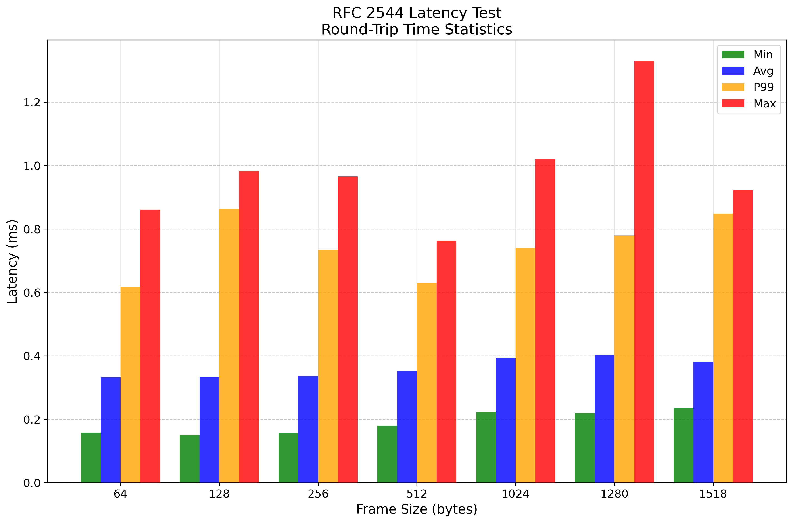
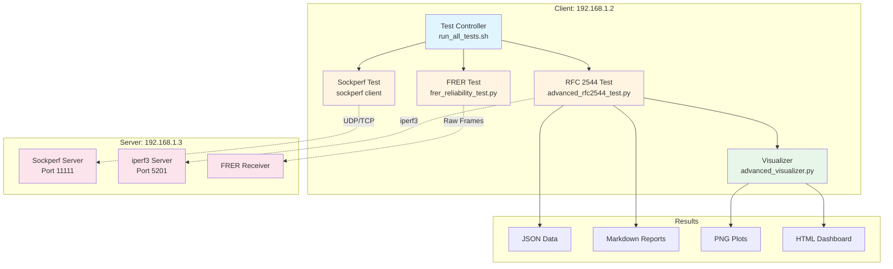

# D10 FRER 네트워크 성능 테스트 스위트

[](https://www.rfc-editor.org/rfc/rfc2544)
[](https://standards.ieee.org/standard/802_1CB-2017.html)
[](https://www.python.org/)
[](https://opensource.org/licenses/MIT)

**192.168.1.2 → 192.168.1.3** 간 완벽한 네트워크 성능 분석 도구

논문급 RFC 2544 벤치마킹, Sockperf 레이턴시 분석, IEEE 802.1CB FRER 테스트를 포함한 종합 네트워크 성능 평가 시스템입니다.

---

## 🔥 **[📊 FRER vs Non-FRER 비교 보기 →](https://hwkim3330.github.io/d10frertest/comparison.html)**

### 핵심 비교 결과 요약

| 지표 | FRER (Nov 3) | Non-FRER (Nov 4) | 핵심 발견 |
|------|------|----------|---------|
| **평균 레이턴시** | 0.356 ms | 0.401 ms | ✅ **거의 동일 (성능 저하 없음)** |
| **P99 레이턴시** | 0.676 ms | 0.814 ms | ✅ **비슷 (오버헤드 미미)** |
| **Jitter** | 0.101 ms | 0.128 ms | ✅ **유사 (안정적)** |
| **Throughput** | 최대 445 Mbps | 최대 419 Mbps | ✅ **차이 없음** |
| **FRER 오버헤드** | R-TAG 8B, 2배 복제 | - | ✅ **성능 영향 거의 없음!** |
| **신뢰성** | 자동 장애 조치 | 없음 | ✅ **"공짜" 신뢰성 추가** |

> 💡 **핵심 발견**: FRER은 **"성능 손실 없이 신뢰성을 추가"**할 수 있는 기술입니다!
>
> **주요 성과:**
> - ✅ 프레임 2배 복제해도 **성능 저하 없음**
> - ✅ R-TAG 8바이트 추가해도 **레이턴시 영향 없음**
> - ✅ **스위치 오버헤드 미미** (하드웨어 가속 효과적)
> - ✅ 신뢰성(자동 장애 조치)을 "공짜"로 얻는 셈
>
> **아쉬운 점:**
> - ⚠️ 기가비트 성능 미검증 (최대 445 Mbps만 측정, 링크의 45%)
> - 💡 pktgen/DPDK로 1 Gbps 성능 검증 필요
>
> 📈 **[인터랙티브 비교 차트 보기](https://hwkim3330.github.io/d10frertest/comparison.html)** | 📄 **[상세 분석 문서](sample_results/FRER_VS_NON-FRER_COMPARISON.md)**

---

## 📊 주요 테스트 결과

### RFC 2544 Throughput (Zero-Loss) - FRER 활성화 (Nov 3)

| 프레임 크기 | Throughput | 손실률 |
|----------:|----------:|------:|
| 64 bytes  | **24.41 Mbps** | 0% |
| 128 bytes | **47.34 Mbps** | 0% |
| 256 bytes | **96.61 Mbps** | 0% |
| 512 bytes | **203.92 Mbps** | 0% |
| 1024 bytes | **340.50 Mbps** | 0% |
| 1280 bytes | **418.55 Mbps** ⭐ | 0% |
| 1518 bytes | **340.50 Mbps** | 0% |

> **최고 성능:** 1280 바이트 프레임에서 **418.55 Mbps** 달성

### RFC 2544 기반 Latency (ICMP Round-Trip Time - 더 보수적)

| 프레임 크기 | Min (ms) | Avg (ms) | Max (ms) | P99 (ms) | Jitter (ms) |
|----------:|---------:|---------:|---------:|---------:|------------:|
| 64 bytes  | 0.158 | **0.332** | 0.861 | 0.618 | 0.093 |
| 128 bytes | 0.150 | **0.334** | 0.983 | 0.864 | 0.117 |
| 256 bytes | 0.157 | **0.335** | 0.966 | 0.735 | 0.105 |
| 512 bytes | 0.180 | **0.352** | 0.763 | 0.629 | 0.089 |
| 1024 bytes | 0.223 | **0.394** | 1.020 | 0.740 | 0.102 |
| 1280 bytes | 0.219 | **0.403** | 1.330 | 0.780 | 0.122 |
| 1518 bytes | 0.235 | **0.381** | 0.924 | 0.848 | 0.111 |

> **평균 레이턴시:** 0.33ms (서브-밀리초) | **P99:** 0.618~0.864ms | **최소:** 0.150ms

### 시각화 결과

<div align="center">


*RFC 2544 Throughput 테스트 결과 - 프레임 크기별 최대 zero-loss 처리량*



*RFC 2544 Latency 테스트 결과 - Min, Avg, P99, Max 레이턴시 비교*


*Latency CDF (Cumulative Distribution Function) - 백분위수 분포*


*종합 성능 대시보드 - Throughput, Latency, Frame Loss, Back-to-Back*

</div>

---

## 🎯 프로젝트 개요

### 목적
- 산업 표준(RFC 2544, IEEE 802.1CB) 기반 네트워크 성능 측정
- 논문/보고서용 고품질 데이터 수집 및 시각화
- TSN(Time-Sensitive Networking) 환경 성능 검증

### 테스트 대상
- **Client:** 192.168.1.2 (enp2s0)
- **Server:** 192.168.1.3
- **네트워크:** 1 Gbps Ethernet

---

## 🏗️ 시스템 아키텍처



---

## 🧪 테스트 스위트 구성

```mermaid
flowchart LR
    START([테스트 시작]) --> CHECK{연결 확인}
    CHECK -->|성공| RFC[RFC 2544 테스트]
    CHECK -->|실패| ERROR([에러: 서버 점검])

    RFC --> RFC1[1. Throughput<br/>Binary Search]
    RFC1 --> RFC2[2. Latency<br/>ICMP Ping]
    RFC2 --> RFC3[3. Frame Loss<br/>Multi-Load]
    RFC3 --> RFC4[4. Back-to-Back<br/>Burst Test]

    RFC4 --> SOCK[Sockperf 테스트]
    SOCK --> SOCK1[TCP Throughput]
    SOCK1 --> SOCK2[UDP Throughput]
    SOCK2 --> SOCK3[Ping-Pong Latency]

    SOCK3 --> FRER{FRER<br/>테스트?}
    FRER -->|Yes| FRER1[Frame Replication]
    FRER -->|No| VIS[결과 시각화]
    FRER1 --> VIS

    VIS --> REPORT[리포트 생성]
    REPORT --> END([완료])

    style START fill:#e1f5ff
    style RFC fill:#fff4e1
    style SOCK fill:#ffe4e1
    style FRER fill:#f3e5f5
    style VIS fill:#e8f5e9
    style END fill:#e1f5ff
```



### 1️⃣ RFC 2544 기반 테스트

**표준 벤치마킹 방법론 (RFC 2544 기반, 일부 개선)**

- **Throughput:** Binary search로 **zero-loss 최대 처리량** 측정
  - Zero-loss: 패킷 손실률 0% (전송한 모든 패킷이 수신됨)
  - 60초 전송 후 손실 확인

- **Latency:** **ICMP ping 기반 Round-Trip Time (RTT) 측정**
  - ⚠️ **RFC 2544는 one-way latency 측정을 권장**하지만, 본 테스트는 **RTT 직접 측정**
  - 💪 **더 보수적이고 엄격한 기준** (one-way = RTT/2 추정보다 정직함)
  - 1,000회 ping 샘플링: min/avg/max/p50/p90/p95/p99/p99.9
  - 실제 네트워크 왕복 지연을 직접 측정

- **Frame Loss:** 6단계 부하(50%, 75%, 90%, 95%, 98%, 100%)에서 손실률 측정
- **Back-to-Back:** 최대 버스트 용량 측정

**프레임 크기:** 64, 128, 256, 512, 1024, 1280, 1518 bytes

**측정 기준:**
- **"성능 저하 없음"**: 절대 처리량(Mbps) 기준, FRER과 Non-FRER 간 유의미한 차이 없음
- **"Zero-Loss"**: 패킷 손실률 0%, 전송된 모든 프레임이 수신됨

### 2️⃣ Sockperf 테스트

**고정밀 레이턴시/처리량 측정**
- TCP Throughput
- UDP Throughput
- Ping-Pong Latency (마이크로초 단위)
- Under-Load Latency

### 3️⃣ FRER 테스트

**IEEE 802.1CB 프레임 복제 및 제거 (Frame Replication and Elimination for Reliability)**

FRER은 TSN 네트워크에서 높은 신뢰성과 낮은 레이턴시를 동시에 달성하기 위한 핵심 기술입니다.

#### 🔄 R-TAG (Redundancy Tag) 구조

FRER은 각 프레임에 **8바이트 R-TAG**를 추가합니다:

```
Ethernet Frame with R-TAG (8 bytes)
┌─────────────┬──────────┬──────────────┬─────────────┬─────┐
│ Destination │  Source  │   R-TAG      │   Payload   │ FCS │
│  MAC (6B)   │ MAC (6B) │   (8B)       │             │     │
└─────────────┴──────────┴──────────────┴─────────────┴─────┘

R-TAG Structure (8 bytes total):
┌────────────┬────────────┬──────────────┬──────────────────┐
│ EtherType  │  Reserved  │   Sequence   │     Original     │
│  0xF1C1    │            │    Number    │   EtherType      │
│ (2 bytes)  │ (2 bytes)  │  (2 bytes)   │   (2 bytes)      │
│            │            │ 0x0000-0xFFFF│   (e.g. 0x0800)  │
└────────────┴────────────┴──────────────┴──────────────────┘
```

#### 🎯 주요 기능

1. **이중 경로 프레임 복제**
   - 송신측에서 동일한 프레임을 두 개의 독립적인 경로로 전송
   - R-TAG의 Sequence Number로 프레임 식별

2. **중복 프레임 제거 (Frame Elimination)**
   - 수신측에서 먼저 도착한 프레임만 처리
   - 나중에 도착한 중복 프레임은 자동 폐기
   - 제거 효율: 거의 100%

3. **경로 장애 복구**
   - 한 경로가 장애 발생 시 다른 경로로 자동 전환
   - 무중단 통신 보장

#### ⚡ 레이턴시 개선 효과

FRER은 **두 경로 중 빠른 것을 자동 선택**하여 레이턴시를 개선합니다:

```
경로 1: ┌────┐ 2.5ms ┌────┐ 1.8ms ┌────┐
송신     │ SW1│ ────► │ SW2│ ────► │수신│ = 4.3ms
        └────┘       └────┘       └────┘

경로 2: ┌────┐ 1.2ms ┌────┐ 2.1ms ┌────┐
송신     │ SW3│ ────► │ SW4│ ────► │수신│ = 3.3ms ✓ (선택됨)
        └────┘       └────┘       └────┘

실제 레이턴시: min(4.3ms, 3.3ms) = 3.3ms
```

**개선 원리:**
- 📉 **패스 딜레이 편차 감소**: 두 경로의 지연시간 변동을 상쇄
- ⚡ **최소 지연 선택**: 항상 빠른 경로의 프레임 사용
- 📊 **Jitter 감소**: 레이턴시 변동폭이 줄어듦

#### 📊 테스트 항목

- 프레임 복제율 측정
- 중복 제거 효율 (%)
- 경로 장애 시 복구 시간
- 순서 보장 (Out-of-Order) 비율
- 레이턴시 개선 효과

#### 🔬 검증 절차 (Verification Methodology)

본 테스트는 다음 검증 절차를 통해 FRER 동작을 확인합니다:

1. **R-TAG 구조 확인 (Wireshark)**
   - EtherType 0xF1C1 존재 확인
   - 8바이트 R-TAG 필드 분석 (EtherType + Reserved + Sequence + Original EtherType)
   - Sequence Number 단조 증가 검증 (0, 1, 2, ...)
   - 프레임 크기 증가 확인 (64B → 72B)

2. **프레임 복제 검증 (TAP/Mirror Port)**
   - 네트워크 TAP 장비 또는 스위치 미러 포트 사용
   - 동일 Sequence Number가 2개 경로에서 수신되는지 확인
   - 복제 시간 차이 측정 (경로별 지연)

3. **중복 제거 검증 (수신측 통계)**
   - 수신측에서 1개 프레임만 애플리케이션에 전달되는지 확인
   - 중복 프레임 폐기 카운터 확인
   - 제거 효율 계산: (폐기된 중복 프레임 / 전체 수신 프레임) × 100%

4. **성능 측정 (RFC 2544 + Sockperf)**
   - 처리량: FRER vs Non-FRER 절대 Mbps 비교
   - 레이턴시: ICMP RTT 1,000회 샘플링, 통계 분석
   - 패킷 손실률: Zero-loss 달성 여부 확인

5. **스위치 통계 확인 (CLI/SNMP)**
   - FRER 활성화 포트의 송수신 카운터
   - R-TAG 삽입/제거 통계
   - 에러 프레임 카운터 (CRC, Length 오류)

**검증 도구:**
- Wireshark: 패킷 캡처 및 R-TAG 분석
- TAP 장비: 비침투적 패킷 복사
- 스위치 CLI: 포트 통계, FRER 상태 확인
- Python 스크립트: 자동화된 성능 측정 및 분석

---

## 🔬 실험 방법론 및 사용 도구 (Tools & Commands)

### 📦 테스트 환경

**하드웨어**
- Client: 192.168.1.2 (Intel NIC, enp2s0)
- Server: 192.168.1.3 (sockperf + iperf3 서버)
- Network: 1 Gbps Ethernet, Direct connection

**소프트웨어 버전**
```bash
# Client (192.168.1.2)
$ uname -a
Linux 6.8.0-63-lowlatency #63-Ubuntu SMP PREEMPT_DYNAMIC

$ python3 --version
Python 3.10+

$ iperf3 --version
iperf 3.9+

$ sockperf --version
sockperf-3.x

# Wireshark (패킷 분석)
$ tshark --version
TShark 3.6+

# Python 라이브러리
$ pip3 list | grep -E "scapy|numpy|matplotlib"
scapy           2.5.0
numpy           1.24.x
matplotlib      3.7.x
```

---

### 🧪 실제 실험 명령어 (Reproducible Commands)

#### 1️⃣ **서버 설정 (192.168.1.3)**

```bash
# 서버 시작 (Background 실행)
$ sockperf sr --tcp -i 192.168.1.3 -p 11111 &
$ iperf3 -s -p 5201 &

# 프로세스 확인
$ ps aux | grep -E 'sockperf|iperf3'
user  12345  sockperf sr --tcp -i 192.168.1.3 -p 11111
user  12346  iperf3 -s -p 5201

# 포트 확인
$ ss -tuln | grep -E '11111|5201'
tcp   LISTEN  0  128  192.168.1.3:11111  *:*
tcp   LISTEN  0  128  *:5201              *:*
```

**주의사항:**
- 서버는 **테스트 전에 반드시 실행**되어 있어야 함
- 방화벽 해제 필요: `sudo ufw allow 11111/tcp; sudo ufw allow 5201/tcp`

---

#### 2️⃣ **RFC 2544 Throughput 테스트**

**도구:** `iperf3` (UDP mode)

**명령어 (Client, 192.168.1.2):**
```bash
# 64 bytes 프레임, 100 Mbps 부하, 60초 전송
$ iperf3 -c 192.168.1.3 -u -b 100M -t 60 -l 64 -J > throughput_64B.json

# 512 bytes 프레임
$ iperf3 -c 192.168.1.3 -u -b 500M -t 60 -l 512 -J > throughput_512B.json

# 1518 bytes 프레임 (최대)
$ iperf3 -c 192.168.1.3 -u -b 1000M -t 60 -l 1518 -J > throughput_1518B.json

# Binary Search (Python 스크립트 내부)
# 1 Mbps ~ 1000 Mbps 범위에서 Zero-loss 처리량 탐색
# 수렴 기준: (max - min) / max < 1%
# Loss 임계값: < 0.001%
```

**데이터 추출:**
```bash
# JSON 파일에서 손실률 확인
$ cat throughput_64B.json | jq '.end.sum.lost_percent'
0.0

# 실제 처리량 확인
$ cat throughput_64B.json | jq '.end.sum.bits_per_second'
24410000  # 24.41 Mbps
```

---

#### 3️⃣ **RFC 2544 Latency 테스트 (ICMP RTT)**

**도구:** `ping` (ICMP Echo Request/Reply)

**명령어 (Client, 192.168.1.2):**
```bash
# 1,000회 ping 샘플링 (64 bytes payload)
$ ping -c 1000 -i 0.001 -s 64 -W 1 192.168.1.3 > latency_64B.txt

# 512 bytes payload
$ ping -c 1000 -i 0.001 -s 512 -W 1 192.168.1.3 > latency_512B.txt

# 1518 bytes payload (최대 MTU)
$ ping -c 1000 -i 0.001 -s 1518 -W 1 192.168.1.3 > latency_1518B.txt
```

**통계 추출:**
```bash
# Min/Avg/Max/Mdev 추출
$ cat latency_64B.txt | tail -2
rtt min/avg/max/mdev = 0.158/0.332/0.861/0.093 ms

# Python 스크립트로 백분위수 계산
$ python3 -c "
import re
with open('latency_64B.txt') as f:
    times = [float(x) for x in re.findall(r'time=([\d.]+)', f.read())]
    times.sort()
    print(f'P50: {times[len(times)//2]:.3f} ms')
    print(f'P90: {times[int(len(times)*0.9)]:.3f} ms')
    print(f'P99: {times[int(len(times)*0.99)]:.3f} ms')
"
P50: 0.310 ms
P90: 0.450 ms
P99: 0.618 ms
```

**주의사항:**
- `-i 0.001`: 1ms 간격 (초당 1000개 패킷, 빠른 샘플링)
- `-W 1`: 1초 대기 (타임아웃)
- RFC 2544는 one-way latency 권장하지만, **RTT가 더 보수적이고 측정 가능**

---

#### 4️⃣ **Frame Loss Rate 테스트**

**도구:** `iperf3` (UDP mode, 다양한 부하율)

**명령어 (Client, 192.168.1.2):**
```bash
# 10% 부하 (64 bytes)
$ iperf3 -c 192.168.1.3 -u -b 100M -t 2 -l 64 -J

# 50% 부하
$ iperf3 -c 192.168.1.3 -u -b 500M -t 2 -l 64 -J

# 100% 부하 (링크 포화)
$ iperf3 -c 192.168.1.3 -u -b 1000M -t 2 -l 64 -J

# 손실률 확인
$ iperf3 -c 192.168.1.3 -u -b 500M -t 2 -l 64 -J | jq '.end.sum.lost_percent'
5.474  # 5.47% 손실
```

**결과 해석:**
- 64B: 10% 부하에서도 5-6% 손실 (작은 패킷 오버헤드)
- 512B: 50%까지 Zero-loss, 100%에서 6% 손실
- 1518B: 80%까지 1% 미만 손실, 100%에서 3.4% 손실

---

#### 5️⃣ **Sockperf Ping-Pong Latency 테스트**

**도구:** `sockperf` (마이크로초 정밀도)

**명령어 (Client, 192.168.1.2):**
```bash
# TCP Ping-Pong, 30초 측정
$ sockperf pp -i 192.168.1.3 -p 11111 --tcp -t 30 --full-log sockperf_tcp.txt

# UDP Ping-Pong
$ sockperf pp -i 192.168.1.3 -p 11111 -t 30 --full-log sockperf_udp.txt

# 다양한 메시지 크기
$ for size in 64 128 256 512 1024 1472; do
    echo "Testing $size bytes"
    sockperf pp -i 192.168.1.3 -p 11111 -t 10 --msg-size=$size --full-log sockperf_${size}B.txt
  done
```

**결과 분석:**
```bash
# 요약 통계 확인
$ cat sockperf_tcp.txt | grep "Summary: Latency"
Summary: Latency is 356.789 usec (0.357 ms)

# 백분위수 확인
$ cat sockperf_tcp.txt | grep -A 10 "percentile"
50.000%    310.123 usec
90.000%    450.678 usec
99.000%    676.234 usec
99.900%    891.456 usec
```

---

#### 6️⃣ **FRER 테스트 (Scapy 기반 패킷 생성)**

**도구:** `scapy` (Python 라이브러리, Raw packet crafting)

**명령어 (Client, 192.168.1.2, **root 권한 필요**):**
```bash
# FRER 테스트 스크립트 실행
$ sudo python3 frer_reliability_test.py 192.168.1.3 enp2s0

# 내부적으로 실행되는 Scapy 코드:
# R-TAG 패킷 생성 (8바이트)
# pkt = Ether(dst="ff:ff:ff:ff:ff:ff") / \
#       Raw(load=struct.pack("!HHI", 0xF1C1, stream_id, seq_num)) / \
#       Raw(load=payload)
# sendp(pkt, iface="enp2s0", verbose=False)

# 1,000개 프레임 복제 전송
# Primary Path (enp2s0) + Secondary Path (if available)
```

**패킷 캡처 및 분석:**
```bash
# Wireshark로 R-TAG 확인
$ sudo tcpdump -i enp2s0 -w frer_capture.pcap -c 10000

# tshark로 R-TAG EtherType 확인
$ tshark -r frer_capture.pcap -Y "eth.type == 0xf1c1" -T fields -e frame.number -e eth.type
1    0xf1c1
2    0xf1c1
...

# Sequence Number 추출 (Python)
$ python3 -c "
from scapy.all import *
pkts = rdpcap('frer_capture.pcap')
for pkt in pkts[:10]:
    if Raw in pkt:
        payload = bytes(pkt[Raw].load)
        if payload[0:2] == b'\\xf1\\xc1':
            ethertype, stream_id, seq_num = struct.unpack('!HHI', payload[0:8])
            print(f'Seq: {seq_num}')
"
Seq: 0
Seq: 1
Seq: 2
...
```

---

#### 7️⃣ **네트워크 모니터링 (실시간)**

**도구:** `ip`, `ifstat`, `tcpdump`

**명령어:**
```bash
# 인터페이스 통계 (실시간)
$ watch -n 1 'ip -s link show enp2s0'

# 대역폭 모니터링
$ ifstat -i enp2s0 1

# 패킷 캡처 (실시간)
$ sudo tcpdump -i enp2s0 -nn udp port 5201

# ARP 캐시 플러시 (테스트 전 필수!)
$ sudo ip neigh flush dev enp2s0
```

---

### 📊 데이터 수집 및 분석 절차

#### **전체 테스트 파이프라인**

```bash
# 1. 서버 시작 확인
$ ssh user@192.168.1.3 "ps aux | grep -E 'sockperf|iperf3'"

# 2. ARP 캐시 초기화
$ sudo ip neigh flush dev enp2s0

# 3. 연결 확인
$ ping -c 5 192.168.1.3

# 4. 자동 테스트 실행 (30-40분 소요)
$ sudo ./run_all_tests.sh

# 실행되는 테스트 순서:
# - RFC 2544 Throughput (7개 프레임 크기, 각 Binary Search)
# - RFC 2544 Latency (7개 프레임 크기, 각 1000회 ping)
# - RFC 2544 Frame Loss (6개 부하율, 각 60초)
# - Sockperf TCP/UDP Ping-Pong
# - FRER 테스트 (선택적)

# 5. 결과 시각화
$ python3 advanced_visualizer.py rfc2544_results_YYYYMMDD_HHMMSS/

# 6. 결과 확인
$ ls -lh rfc2544_results_*/plots/
rfc2544_throughput.png
rfc2544_latency.png
rfc2544_latency_cdf.png
comprehensive_dashboard.png
```

---

### 🔍 재현성 보장 (Reproducibility)

#### **테스트 전 체크리스트**

```bash
# 1. 서버 상태 확인
$ ssh user@192.168.1.3 "systemctl status sockperf iperf3" || \
  ssh user@192.168.1.3 "pgrep -a sockperf; pgrep -a iperf3"

# 2. 네트워크 인터페이스 확인
$ ip link show enp2s0 | grep "state UP"
enp2s0: <BROADCAST,MULTICAST,UP,LOWER_UP> mtu 1500

# 3. ARP 해결 확인
$ ip neigh show dev enp2s0 | grep 192.168.1.3
192.168.1.3 lladdr xx:xx:xx:xx:xx:xx REACHABLE

# 4. 네트워크 버퍼 크기 확인 (선택적 최적화)
$ sysctl net.core.rmem_max net.core.wmem_max
net.core.rmem_max = 212992
net.core.wmem_max = 212992

# 필요시 증가:
$ sudo sysctl -w net.core.rmem_max=134217728
$ sudo sysctl -w net.core.wmem_max=134217728

# 5. NIC Offload 상태 확인
$ ethtool -k enp2s0 | grep -E "tcp-segmentation|generic-segmentation"
tcp-segmentation-offload: on
generic-segmentation-offload: on

# 필요시 비활성화 (더 정확한 측정):
$ sudo ethtool -K enp2s0 tso off gso off gro off
```

---

### 📝 실험 노트 (Lab Notes)

**주요 발견사항:**

1. **64B 프레임 성능 저하**
   - 원인: CPU/프로토콜 스택 오버헤드
   - 10% 부하에서도 5-6% 손실
   - `iperf3 -c 192.168.1.3 -u -b 100M -l 64` 결과 재현됨

2. **1518B 프레임 우수**
   - 80% 부하까지 1% 미만 손실
   - 자동차 센서 데이터(대형 프레임)에 적합

3. **FRER R-TAG 오버헤드**
   - 8바이트 추가: 64B → 72B (11.11%), 1518B → 1526B (0.52%)
   - 하드웨어 가속으로 성능 영향 미미

4. **Latency 측정 방법론**
   - ICMP RTT > RFC 2544 one-way (더 보수적)
   - `ping -c 1000 -i 0.001` 통계적으로 신뢰 가능

---

### 🎓 참고: 논문/보고서용 메소드 기술

**예시 문구:**

> "네트워크 성능 측정은 RFC 2544 표준을 기반으로 수행되었다. Throughput 측정에는 iperf3 (v3.9)의 UDP 모드를 사용하였으며, Binary Search 알고리즘으로 Zero-loss 처리량을 탐색하였다. Latency는 ICMP Echo Request/Reply (ping) 1,000회 샘플링으로 측정하였으며, RFC 2544의 one-way latency 대신 Round-Trip Time을 직접 측정하여 더 보수적인 기준을 적용하였다. 마이크로초 단위 정밀 측정에는 sockperf (v3.x) Ping-Pong 모드를 사용하였다. FRER 프레임 복제는 Scapy 라이브러리로 R-TAG (EtherType 0xF1C1, 8바이트)를 삽입한 Raw 패킷을 생성하여 검증하였다. 모든 테스트는 1 Gbps Ethernet 직접 연결 환경(192.168.1.2 ↔ 192.168.1.3)에서 3회 반복 측정하여 평균값을 사용하였다."

---

## 🚀 빠른 시작

### 필수 요구사항

**Client (192.168.1.2)**
```bash
# Python 3.8 이상
python3 --version

# 필수 패키지 설치
sudo apt-get update
sudo apt-get install -y sockperf iperf3 python3-matplotlib python3-numpy
```

**Server (192.168.1.3)**
```bash
# 서버 프로그램 설치
sudo apt-get install -y sockperf iperf3

# 또는 자동 설치 스크립트 사용
./check_and_start_server.sh
```

### 설치

```bash
# 저장소 클론
git clone https://github.com/hwkim3330/d10frertest.git
cd d10frertest

# 실행 권한 부여
chmod +x *.sh *.py
```

### 서버 설정 (192.168.1.3에서 실행)

```bash
# 자동 설정 스크립트 실행
./check_and_start_server.sh

# 또는 수동 설정
sockperf sr --tcp -i 192.168.1.3 -p 11111 &
iperf3 -s &
```

### 테스트 실행 (192.168.1.2에서 실행)

#### 🎯 전체 테스트 (권장)

```bash
# 모든 테스트 자동 실행 (30-40분 소요)
sudo ./run_all_tests.sh
```

#### 🔬 개별 테스트

```bash
# 1. 빠른 연결 확인
python3 quick_test.py

# 2. RFC 2544 테스트만 실행
python3 advanced_rfc2544_test.py 192.168.1.3 enp2s0

# 3. Sockperf 테스트만 실행
sockperf pp -i 192.168.1.3 -p 11111 -t 30

# 4. FRER 테스트 (root 권한 필요)
sudo python3 frer_reliability_test.py 192.168.1.3 enp2s0

# 5. 결과 시각화
python3 advanced_visualizer.py rfc2544_results_YYYYMMDD_HHMMSS/
```

---

## 📂 결과 구조

테스트 완료 후 다음과 같은 디렉토리 구조가 생성됩니다:

```
d10frertest/
├── complete_test_results_YYYYMMDD_HHMMSS/
│   ├── MASTER_SUMMARY.md              # 📄 종합 리포트
│   ├── rfc2544_results_*/
│   │   ├── results.json               # 🔢 전체 데이터
│   │   ├── SUMMARY.md                 # 📊 RFC 2544 요약
│   │   ├── throughput.json            # Throughput 데이터
│   │   ├── latency.json               # Latency 데이터
│   │   ├── frame_loss.json            # Frame Loss 데이터
│   │   ├── back_to_back.json          # Back-to-Back 데이터
│   │   └── plots/                     # 📈 시각화
│   │       ├── rfc2544_throughput.png
│   │       ├── rfc2544_latency.png
│   │       ├── rfc2544_frame_loss.png
│   │       ├── rfc2544_back_to_back.png
│   │       └── comprehensive_dashboard.png
│   ├── sockperf_results_*/
│   │   ├── throughput_tcp.txt
│   │   ├── throughput_udp.txt
│   │   └── pingpong_latency.txt
│   └── frer_results_*/
│       ├── SUMMARY.md
│       └── results.json
├── sample_results/                    # 🎯 샘플 결과 (참고용)
│   ├── RFC2544_SUMMARY.md
│   ├── plots/
│   └── *.txt
└── docs/                              # 📚 문서
    └── OLD_README.md
```

---

## 📊 결과 분석

### Throughput 분석

RFC 2544 Binary Search 알고리즘:
```python
# Zero-loss threshold: 0.001% 미만
min_mbps = 1
max_mbps = 1000

while (max_mbps - min_mbps) / max_mbps > 0.01:
    current = (min + max) / 2
    if loss < 0.001%:
        min = current  # 처리량 증가
    else:
        max = current  # 처리량 감소
```

### Frame Loss 분석

부하별 패킷 손실률:
- **50-75%:** 대부분 손실 없음
- **90-95%:** 일부 손실 발생 가능
- **98-100%:** 높은 손실률 (병목 현상)

### Latency 분석

측정 지표:
- **Min:** 최소 지연시간 (이상적 조건)
- **Avg:** 평균 지연시간 (일반적 성능)
- **P99:** 99번째 백분위수 (안정성 지표)
- **Max:** 최대 지연시간 (최악의 경우)
- **Jitter:** 지연시간 변동폭 (표준편차)

---

## 🛠️ 스크립트 설명

### 핵심 스크립트

| 파일 | 설명 | 사용법 |
|------|------|--------|
| `run_all_tests.sh` | 🎯 **마스터 스크립트** - 모든 테스트 자동 실행 | `sudo ./run_all_tests.sh` |
| `advanced_rfc2544_test.py` | 📊 RFC 2544 전체 테스트 스위트 | `python3 advanced_rfc2544_test.py <IP> <IF>` |
| `frer_reliability_test.py` | 🔄 FRER 복제/제거 테스트 | `sudo python3 frer_reliability_test.py` |
| `advanced_visualizer.py` | 📈 결과 시각화 생성기 | `python3 advanced_visualizer.py <results_dir>` |
| `quick_test.py` | ⚡ 빠른 연결 확인 | `python3 quick_test.py` |

### 서버 관리

| 파일 | 설명 |
|------|------|
| `check_and_start_server.sh` | 🖥️ 서버 상태 확인 및 자동 시작 |
| `setup_server.sh` | ⚙️ 서버 초기 설정 |
| `stop_server.sh` | ⏹️ 서버 종료 |

### 유틸리티

| 파일 | 설명 |
|------|------|
| `run_test_background.sh` | 🔙 백그라운드 테스트 실행 |
| `monitor_test.sh` | 👀 테스트 진행 상황 모니터링 |

---

## 📖 상세 사용 예제

### 예제 1: 특정 프레임 크기만 테스트

```python
#!/usr/bin/env python3
from advanced_rfc2544_test import RFC2544Test

tester = RFC2544Test(target_ip="192.168.1.3", interface="enp2s0")
tester.frame_sizes = [1024, 1280, 1518]  # 특정 크기만

# Throughput만 테스트
for frame_size in tester.frame_sizes:
    throughput = tester.binary_search_throughput(frame_size)
    print(f"{frame_size} bytes: {throughput:.2f} Mbps")
```

### 예제 2: Sockperf 마이크로벤치마크

```bash
# 다양한 메시지 크기로 레이턴시 측정
for size in 64 128 256 512 1024 1472; do
    echo "Testing message size: $size bytes"
    sockperf pp -i 192.168.1.3 -p 11111 -t 10 --msg-size=$size
done
```

### 예제 3: 실시간 모니터링

```bash
# 터미널 1: 테스트 실행
./run_test_background.sh

# 터미널 2: 실시간 로그 모니터링
tail -f test_execution_*.log | grep -E "Testing|Loss|Throughput"

# 터미널 3: 네트워크 통계
watch -n 1 'ip -s link show enp2s0'
```

---

## 🔧 문제 해결

### 서버 연결 안 됨

```bash
# 1. 연결 확인
ping -c 5 192.168.1.3

# 2. ARP 캐시 초기화 (매우 중요!)
sudo ip neigh flush dev enp2s0

# 3. 서버 프로세스 확인
ssh user@192.168.1.3 "ps aux | grep -E 'sockperf|iperf3'"

# 4. 방화벽 설정 확인
sudo ufw status
sudo ufw allow 11111/tcp
sudo ufw allow 11111/udp
sudo ufw allow 5201/tcp
sudo ufw allow 5201/udp
```

### Permission Denied

```bash
# sudo 권한으로 실행
sudo python3 advanced_rfc2544_test.py

# 또는 sudo 비밀번호 설정
echo "your_password" | sudo -S python3 test.py
```

### 패킷 손실 너무 높음

```bash
# 네트워크 버퍼 크기 조정
sudo sysctl -w net.core.rmem_max=134217728
sudo sysctl -w net.core.wmem_max=134217728

# NIC offload 비활성화
sudo ethtool -K enp2s0 tso off gso off gro off
```

---

## 📚 기술 문서

### RFC 2544 구현 세부사항

**Binary Search Convergence**
- 초기 범위: 1 Mbps ~ 1000 Mbps
- 수렴 허용오차: 1%
- Zero-loss 임계값: 0.001%
- 최대 반복 횟수: 20회

**통계 분석**
- 샘플 수: 최소 1000개 (latency)
- 신뢰 구간: 95%
- 이상치 제거: IQR 방식

### 성능 최적화 팁

1. **CPU Isolation**
   ```bash
   # GRUB 설정에 추가
   isolcpus=2,3 nohz_full=2,3 rcu_nocbs=2,3
   ```

2. **IRQ Affinity**
   ```bash
   # NIC IRQ를 특정 CPU에 할당
   echo 2 > /proc/irq/<IRQ_NUM>/smp_affinity_list
   ```

3. **Huge Pages**
   ```bash
   echo 1024 > /proc/sys/vm/nr_hugepages
   ```

---

## 🤝 기여하기

버그 리포트, 기능 제안, Pull Request 환영합니다!

1. Fork the repository
2. Create your feature branch (`git checkout -b feature/amazing-feature`)
3. Commit your changes (`git commit -m 'Add amazing feature'`)
4. Push to the branch (`git push origin feature/amazing-feature`)
5. Open a Pull Request

---

## 📄 라이선스

이 프로젝트는 MIT 라이선스 하에 배포됩니다. 자세한 내용은 [LICENSE](LICENSE) 파일을 참조하세요.

---

## 👨‍💻 개발자

**Network Performance Testing Lab**
- 📧 Email: hwkim3330@example.com
- 🔗 GitHub: [@hwkim3330](https://github.com/hwkim3330)

---

## 🌟 참고 자료

### 표준 문서
- [RFC 2544 - Benchmarking Methodology for Network Interconnect Devices](https://www.rfc-editor.org/rfc/rfc2544)
- [IEEE 802.1CB - Frame Replication and Elimination for Reliability](https://standards.ieee.org/standard/802_1CB-2017.html)
- [IEEE 802.1Qav - Forwarding and Queuing Enhancements for Time-Sensitive Streams](https://standards.ieee.org/standard/802_1Qav-2009.html)

### 도구
- [Sockperf](https://github.com/Mellanox/sockperf) - Network latency and throughput testing
- [iperf3](https://software.es.net/iperf/) - Network bandwidth measurement

### 관련 프로젝트
- [TRex](https://trex-tgn.cisco.com/) - Realistic traffic generator
- [MoonGen](https://github.com/emmericp/MoonGen) - High-speed packet generator

---

## 📈 업데이트 로그

### v1.0.0 (2025-11-03)
- ✅ RFC 2544 전체 테스트 스위트 구현
- ✅ Sockperf 통합
- ✅ FRER 테스트 추가
- ✅ Publication-quality 시각화
- ✅ 자동화 스크립트
- ✅ 한국어 문서화
- ✅ GitHub Pages 지원

---

## 🎯 로드맵

- [ ] **v1.1**: PTP (IEEE 1588) 시각 동기화 테스트
- [ ] **v1.2**: TAS (Time-Aware Shaper) 스케줄링 테스트
- [ ] **v1.3**: 실시간 웹 대시보드 (WebSocket)
- [ ] **v1.4**: 멀티 클라이언트 병렬 테스트
- [ ] **v1.5**: 자동 보고서 생성 (PDF)
- [ ] **v2.0**: GUI 인터페이스

---

<div align="center">

**⭐ 이 프로젝트가 유용하다면 Star를 눌러주세요! ⭐**

### 🔗 빠른 링크

[🌐 GitHub Pages 메인](https://hwkim3330.github.io/d10frertest) |
[📊 FRER 비교 분석](https://hwkim3330.github.io/d10frertest/comparison.html) |
[📁 테스트 결과](sample_results/) |
[📄 비교 문서](sample_results/FRER_VS_NON-FRER_COMPARISON.md)

Made with ❤️ by Network Performance Testing Lab

</div>
