# D10 FRER 네트워크 성능 테스트 스위트

[](https://www.rfc-editor.org/rfc/rfc2544)
[](https://standards.ieee.org/standard/802_1CB-2017.html)
[](https://www.python.org/)
[](https://opensource.org/licenses/MIT)

**192.168.1.2 → 192.168.1.3** 간 완벽한 네트워크 성능 분석 도구

논문급 RFC 2544 벤치마킹, Sockperf 레이턴시 분석, IEEE 802.1CB FRER 테스트를 포함한 종합 네트워크 성능 평가 시스템입니다.

---

## 📊 주요 테스트 결과

### RFC 2544 Throughput (Zero-Loss)

| 프레임 크기 | Throughput | 손실률 |
|----------:|----------:|------:|
| 64 bytes  | **24.41 Mbps** | 0% |
| 128 bytes | **47.34 Mbps** | 0% |
| 256 bytes | **96.61 Mbps** | 0% |
| 512 bytes | **203.92 Mbps** | 0% |
| 1024 bytes | **340.50 Mbps** | 0% |
| 1280 bytes | **418.55 Mbps** ⭐ | 0% |
| 1518 bytes | **340.50 Mbps** | 0% |

> **최고 성능:** 1280 바이트 프레임에서 **418.55 Mbps** 달성

### RFC 2544 Latency (ICMP Round-Trip Time)

| 프레임 크기 | Min (ms) | Avg (ms) | Max (ms) | P99 (ms) | Jitter (ms) |
|----------:|---------:|---------:|---------:|---------:|------------:|
| 64 bytes  | 0.158 | **0.332** | 0.861 | 0.618 | 0.093 |
| 128 bytes | 0.150 | **0.334** | 0.983 | 0.864 | 0.117 |
| 256 bytes | 0.157 | **0.335** | 0.966 | 0.735 | 0.105 |
| 512 bytes | 0.180 | **0.352** | 0.763 | 0.629 | 0.089 |
| 1024 bytes | 0.223 | **0.394** | 1.020 | 0.740 | 0.102 |
| 1280 bytes | 0.219 | **0.403** | 1.330 | 0.780 | 0.122 |
| 1518 bytes | 0.235 | **0.381** | 0.924 | 0.848 | 0.111 |

> **평균 레이턴시:** 0.33ms (서브-밀리초) | **P99:** 0.618~0.864ms | **최소:** 0.150ms

### 시각화 결과

<div align="center">


*RFC 2544 Throughput 테스트 결과 - 프레임 크기별 최대 zero-loss 처리량*


*RFC 2544 Latency 테스트 결과 - Min, Avg, P99, Max 레이턴시 비교*


*Latency CDF (Cumulative Distribution Function) - 백분위수 분포*


*종합 성능 대시보드 - Throughput, Latency, Frame Loss, Back-to-Back*

</div>

---

## 🎯 프로젝트 개요

### 목적
- 산업 표준(RFC 2544, IEEE 802.1CB) 기반 네트워크 성능 측정
- 논문/보고서용 고품질 데이터 수집 및 시각화
- TSN(Time-Sensitive Networking) 환경 성능 검증

### 테스트 대상
- **Client:** 192.168.1.2 (enp2s0)
- **Server:** 192.168.1.3
- **네트워크:** 1 Gbps Ethernet

---

## 🏗️ 시스템 아키텍처


---

## 🧪 테스트 스위트 구성

```mermaid
flowchart LR
    START([테스트 시작]) --> CHECK{연결 확인}
    CHECK -->|성공| RFC[RFC 2544 테스트]
    CHECK -->|실패| ERROR([에러: 서버 점검])

    RFC --> RFC1[1. Throughput<br/>Binary Search]
    RFC1 --> RFC2[2. Latency<br/>ICMP Ping]
    RFC2 --> RFC3[3. Frame Loss<br/>Multi-Load]
    RFC3 --> RFC4[4. Back-to-Back<br/>Burst Test]

    RFC4 --> SOCK[Sockperf 테스트]
    SOCK --> SOCK1[TCP Throughput]
    SOCK1 --> SOCK2[UDP Throughput]
    SOCK2 --> SOCK3[Ping-Pong Latency]

    SOCK3 --> FRER{FRER<br/>테스트?}
    FRER -->|Yes| FRER1[Frame Replication]
    FRER -->|No| VIS[결과 시각화]
    FRER1 --> VIS

    VIS --> REPORT[리포트 생성]
    REPORT --> END([완료])

    style START fill:#e1f5ff
    style RFC fill:#fff4e1
    style SOCK fill:#ffe4e1
    style FRER fill:#f3e5f5
    style VIS fill:#e8f5e9
    style END fill:#e1f5ff
```



### 1️⃣ RFC 2544 테스트

**표준 벤치마킹 방법론**
- **Throughput:** Binary search로 zero-loss 최대 처리량 측정
- **Latency:** ICMP ping 기반 RTT 측정 (min/avg/max/p50/p90/p95/p99/p99.9)
- **Frame Loss:** 6단계 부하(50%, 75%, 90%, 95%, 98%, 100%)에서 손실률 측정
- **Back-to-Back:** 최대 버스트 용량 측정

**프레임 크기:** 64, 128, 256, 512, 1024, 1280, 1518 bytes

### 2️⃣ Sockperf 테스트

**고정밀 레이턴시/처리량 측정**
- TCP Throughput
- UDP Throughput
- Ping-Pong Latency (마이크로초 단위)
- Under-Load Latency

### 3️⃣ FRER 테스트

**IEEE 802.1CB 프레임 복제 및 제거 (Frame Replication and Elimination for Reliability)**

FRER은 TSN 네트워크에서 높은 신뢰성과 낮은 레이턴시를 동시에 달성하기 위한 핵심 기술입니다.

#### 🔄 R-TAG (Redundancy Tag) 구조

FRER은 각 프레임에 **6바이트 R-TAG**를 추가합니다:

```
Ethernet Frame with R-TAG (6 bytes)
┌─────────────┬──────────┬──────────────┬─────────────┬─────┐
│ Destination │  Source  │   R-TAG      │   Payload   │ FCS │
│  MAC (6B)   │ MAC (6B) │   (6B)       │             │     │
└─────────────┴──────────┴──────────────┴─────────────┴─────┘

R-TAG Structure:
┌──────────────┬──────────────┬─────────────────────┐
│  EtherType   │  Stream ID   │  Sequence Number    │
│   (0xF1C1)   │   (2 bytes)  │     (4 bytes)       │
│   2 bytes    │              │                     │
└──────────────┴──────────────┴─────────────────────┘
```

#### 🎯 주요 기능

1. **이중 경로 프레임 복제**
   - 송신측에서 동일한 프레임을 두 개의 독립적인 경로로 전송
   - R-TAG의 Sequence Number로 프레임 식별

2. **중복 프레임 제거 (Frame Elimination)**
   - 수신측에서 먼저 도착한 프레임만 처리
   - 나중에 도착한 중복 프레임은 자동 폐기
   - 제거 효율: 거의 100%

3. **경로 장애 복구**
   - 한 경로가 장애 발생 시 다른 경로로 자동 전환
   - 무중단 통신 보장

#### ⚡ 레이턴시 개선 효과

FRER은 **두 경로 중 빠른 것을 자동 선택**하여 레이턴시를 개선합니다:

```
경로 1: ┌────┐ 2.5ms ┌────┐ 1.8ms ┌────┐
송신     │ SW1│ ────► │ SW2│ ────► │수신│ = 4.3ms
        └────┘       └────┘       └────┘

경로 2: ┌────┐ 1.2ms ┌────┐ 2.1ms ┌────┐
송신     │ SW3│ ────► │ SW4│ ────► │수신│ = 3.3ms ✓ (선택됨)
        └────┘       └────┘       └────┘

실제 레이턴시: min(4.3ms, 3.3ms) = 3.3ms
```

**개선 원리:**
- 📉 **패스 딜레이 편차 감소**: 두 경로의 지연시간 변동을 상쇄
- ⚡ **최소 지연 선택**: 항상 빠른 경로의 프레임 사용
- 📊 **Jitter 감소**: 레이턴시 변동폭이 줄어듦

#### 📊 테스트 항목

- 프레임 복제율 측정
- 중복 제거 효율 (%)
- 경로 장애 시 복구 시간
- 순서 보장 (Out-of-Order) 비율
- 레이턴시 개선 효과

---

## 🚀 빠른 시작

### 필수 요구사항

**Client (192.168.1.2)**
```bash
# Python 3.8 이상
python3 --version

# 필수 패키지 설치
sudo apt-get update
sudo apt-get install -y sockperf iperf3 python3-matplotlib python3-numpy
```

**Server (192.168.1.3)**
```bash
# 서버 프로그램 설치
sudo apt-get install -y sockperf iperf3

# 또는 자동 설치 스크립트 사용
./check_and_start_server.sh
```

### 설치

```bash
# 저장소 클론
git clone https://github.com/hwkim3330/d10frertest.git
cd d10frertest

# 실행 권한 부여
chmod +x *.sh *.py
```

### 서버 설정 (192.168.1.3에서 실행)

```bash
# 자동 설정 스크립트 실행
./check_and_start_server.sh

# 또는 수동 설정
sockperf sr --tcp -i 192.168.1.3 -p 11111 &
iperf3 -s &
```

### 테스트 실행 (192.168.1.2에서 실행)

#### 🎯 전체 테스트 (권장)

```bash
# 모든 테스트 자동 실행 (30-40분 소요)
sudo ./run_all_tests.sh
```

#### 🔬 개별 테스트

```bash
# 1. 빠른 연결 확인
python3 quick_test.py

# 2. RFC 2544 테스트만 실행
python3 advanced_rfc2544_test.py 192.168.1.3 enp2s0

# 3. Sockperf 테스트만 실행
sockperf pp -i 192.168.1.3 -p 11111 -t 30

# 4. FRER 테스트 (root 권한 필요)
sudo python3 frer_reliability_test.py 192.168.1.3 enp2s0

# 5. 결과 시각화
python3 advanced_visualizer.py rfc2544_results_YYYYMMDD_HHMMSS/
```

---

## 📂 결과 구조

테스트 완료 후 다음과 같은 디렉토리 구조가 생성됩니다:

```
d10frertest/
├── complete_test_results_YYYYMMDD_HHMMSS/
│   ├── MASTER_SUMMARY.md              # 📄 종합 리포트
│   ├── rfc2544_results_*/
│   │   ├── results.json               # 🔢 전체 데이터
│   │   ├── SUMMARY.md                 # 📊 RFC 2544 요약
│   │   ├── throughput.json            # Throughput 데이터
│   │   ├── latency.json               # Latency 데이터
│   │   ├── frame_loss.json            # Frame Loss 데이터
│   │   ├── back_to_back.json          # Back-to-Back 데이터
│   │   └── plots/                     # 📈 시각화
│   │       ├── rfc2544_throughput.png
│   │       ├── rfc2544_latency.png
│   │       ├── rfc2544_frame_loss.png
│   │       ├── rfc2544_back_to_back.png
│   │       └── comprehensive_dashboard.png
│   ├── sockperf_results_*/
│   │   ├── throughput_tcp.txt
│   │   ├── throughput_udp.txt
│   │   └── pingpong_latency.txt
│   └── frer_results_*/
│       ├── SUMMARY.md
│       └── results.json
├── sample_results/                    # 🎯 샘플 결과 (참고용)
│   ├── RFC2544_SUMMARY.md
│   ├── plots/
│   └── *.txt
└── docs/                              # 📚 문서
    └── OLD_README.md
```

---

## 📊 결과 분석

### Throughput 분석

RFC 2544 Binary Search 알고리즘:
```python
# Zero-loss threshold: 0.001% 미만
min_mbps = 1
max_mbps = 1000

while (max_mbps - min_mbps) / max_mbps > 0.01:
    current = (min + max) / 2
    if loss < 0.001%:
        min = current  # 처리량 증가
    else:
        max = current  # 처리량 감소
```

### Frame Loss 분석

부하별 패킷 손실률:
- **50-75%:** 대부분 손실 없음
- **90-95%:** 일부 손실 발생 가능
- **98-100%:** 높은 손실률 (병목 현상)

### Latency 분석

측정 지표:
- **Min:** 최소 지연시간 (이상적 조건)
- **Avg:** 평균 지연시간 (일반적 성능)
- **P99:** 99번째 백분위수 (안정성 지표)
- **Max:** 최대 지연시간 (최악의 경우)
- **Jitter:** 지연시간 변동폭 (표준편차)

---

## 🛠️ 스크립트 설명

### 핵심 스크립트

| 파일 | 설명 | 사용법 |
|------|------|--------|
| `run_all_tests.sh` | 🎯 **마스터 스크립트** - 모든 테스트 자동 실행 | `sudo ./run_all_tests.sh` |
| `advanced_rfc2544_test.py` | 📊 RFC 2544 전체 테스트 스위트 | `python3 advanced_rfc2544_test.py <IP> <IF>` |
| `frer_reliability_test.py` | 🔄 FRER 복제/제거 테스트 | `sudo python3 frer_reliability_test.py` |
| `advanced_visualizer.py` | 📈 결과 시각화 생성기 | `python3 advanced_visualizer.py <results_dir>` |
| `quick_test.py` | ⚡ 빠른 연결 확인 | `python3 quick_test.py` |

### 서버 관리

| 파일 | 설명 |
|------|------|
| `check_and_start_server.sh` | 🖥️ 서버 상태 확인 및 자동 시작 |
| `setup_server.sh` | ⚙️ 서버 초기 설정 |
| `stop_server.sh` | ⏹️ 서버 종료 |

### 유틸리티

| 파일 | 설명 |
|------|------|
| `run_test_background.sh` | 🔙 백그라운드 테스트 실행 |
| `monitor_test.sh` | 👀 테스트 진행 상황 모니터링 |

---

## 📖 상세 사용 예제

### 예제 1: 특정 프레임 크기만 테스트

```python
#!/usr/bin/env python3
from advanced_rfc2544_test import RFC2544Test

tester = RFC2544Test(target_ip="192.168.1.3", interface="enp2s0")
tester.frame_sizes = [1024, 1280, 1518]  # 특정 크기만

# Throughput만 테스트
for frame_size in tester.frame_sizes:
    throughput = tester.binary_search_throughput(frame_size)
    print(f"{frame_size} bytes: {throughput:.2f} Mbps")
```

### 예제 2: Sockperf 마이크로벤치마크

```bash
# 다양한 메시지 크기로 레이턴시 측정
for size in 64 128 256 512 1024 1472; do
    echo "Testing message size: $size bytes"
    sockperf pp -i 192.168.1.3 -p 11111 -t 10 --msg-size=$size
done
```

### 예제 3: 실시간 모니터링

```bash
# 터미널 1: 테스트 실행
./run_test_background.sh

# 터미널 2: 실시간 로그 모니터링
tail -f test_execution_*.log | grep -E "Testing|Loss|Throughput"

# 터미널 3: 네트워크 통계
watch -n 1 'ip -s link show enp2s0'
```

---

## 🔧 문제 해결

### 서버 연결 안 됨

```bash
# 1. 연결 확인
ping -c 5 192.168.1.3

# 2. ARP 캐시 초기화 (매우 중요!)
sudo ip neigh flush dev enp2s0

# 3. 서버 프로세스 확인
ssh user@192.168.1.3 "ps aux | grep -E 'sockperf|iperf3'"

# 4. 방화벽 설정 확인
sudo ufw status
sudo ufw allow 11111/tcp
sudo ufw allow 11111/udp
sudo ufw allow 5201/tcp
sudo ufw allow 5201/udp
```

### Permission Denied

```bash
# sudo 권한으로 실행
sudo python3 advanced_rfc2544_test.py

# 또는 sudo 비밀번호 설정
echo "your_password" | sudo -S python3 test.py
```

### 패킷 손실 너무 높음

```bash
# 네트워크 버퍼 크기 조정
sudo sysctl -w net.core.rmem_max=134217728
sudo sysctl -w net.core.wmem_max=134217728

# NIC offload 비활성화
sudo ethtool -K enp2s0 tso off gso off gro off
```

---

## 📚 기술 문서

### RFC 2544 구현 세부사항

**Binary Search Convergence**
- 초기 범위: 1 Mbps ~ 1000 Mbps
- 수렴 허용오차: 1%
- Zero-loss 임계값: 0.001%
- 최대 반복 횟수: 20회

**통계 분석**
- 샘플 수: 최소 1000개 (latency)
- 신뢰 구간: 95%
- 이상치 제거: IQR 방식

### 성능 최적화 팁

1. **CPU Isolation**
   ```bash
   # GRUB 설정에 추가
   isolcpus=2,3 nohz_full=2,3 rcu_nocbs=2,3
   ```

2. **IRQ Affinity**
   ```bash
   # NIC IRQ를 특정 CPU에 할당
   echo 2 > /proc/irq/<IRQ_NUM>/smp_affinity_list
   ```

3. **Huge Pages**
   ```bash
   echo 1024 > /proc/sys/vm/nr_hugepages
   ```

---

## 🤝 기여하기

버그 리포트, 기능 제안, Pull Request 환영합니다!

1. Fork the repository
2. Create your feature branch (`git checkout -b feature/amazing-feature`)
3. Commit your changes (`git commit -m 'Add amazing feature'`)
4. Push to the branch (`git push origin feature/amazing-feature`)
5. Open a Pull Request

---

## 📄 라이선스

이 프로젝트는 MIT 라이선스 하에 배포됩니다. 자세한 내용은 [LICENSE](LICENSE) 파일을 참조하세요.

---

## 👨‍💻 개발자

**Network Performance Testing Lab**
- 📧 Email: hwkim3330@example.com
- 🔗 GitHub: [@hwkim3330](https://github.com/hwkim3330)

---

## 🌟 참고 자료

### 표준 문서
- [RFC 2544 - Benchmarking Methodology for Network Interconnect Devices](https://www.rfc-editor.org/rfc/rfc2544)
- [IEEE 802.1CB - Frame Replication and Elimination for Reliability](https://standards.ieee.org/standard/802_1CB-2017.html)
- [IEEE 802.1Qav - Forwarding and Queuing Enhancements for Time-Sensitive Streams](https://standards.ieee.org/standard/802_1Qav-2009.html)

### 도구
- [Sockperf](https://github.com/Mellanox/sockperf) - Network latency and throughput testing
- [iperf3](https://software.es.net/iperf/) - Network bandwidth measurement

### 관련 프로젝트
- [TRex](https://trex-tgn.cisco.com/) - Realistic traffic generator
- [MoonGen](https://github.com/emmericp/MoonGen) - High-speed packet generator

---

## 📈 업데이트 로그

### v1.0.0 (2025-11-03)
- ✅ RFC 2544 전체 테스트 스위트 구현
- ✅ Sockperf 통합
- ✅ FRER 테스트 추가
- ✅ Publication-quality 시각화
- ✅ 자동화 스크립트
- ✅ 한국어 문서화
- ✅ GitHub Pages 지원

---

## 🎯 로드맵

- [ ] **v1.1**: PTP (IEEE 1588) 시각 동기화 테스트
- [ ] **v1.2**: TAS (Time-Aware Shaper) 스케줄링 테스트
- [ ] **v1.3**: 실시간 웹 대시보드 (WebSocket)
- [ ] **v1.4**: 멀티 클라이언트 병렬 테스트
- [ ] **v1.5**: 자동 보고서 생성 (PDF)
- [ ] **v2.0**: GUI 인터페이스

---

<div align="center">

**⭐ 이 프로젝트가 유용하다면 Star를 눌러주세요! ⭐**

[🌐 GitHub Pages 데모](https://hwkim3330.github.io/d10frertest) | [📊 샘플 결과](sample_results/) | [📖 문서](docs/)

Made with ❤️ by Network Performance Testing Lab

</div>
